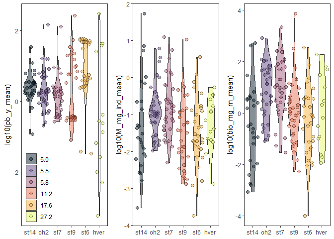

## Analysis

Preliminary figures for exploring data analyses and figures.

### Histograms of PB, M, and Biomass among streams.

<!-- -->

### Rank plots 


## Reproducibility

<details><summary>Reproducibility receipt</summary>


```
## [1] "2020-12-07 16:05:57 CST"
```

```
## Local:    main C:/Users/james/Documents/Projects/temperature_energy-flux
## Remote:   main @ origin (https://github.com/jimjunker1/temperature_energy-flux.git)
## Head:     [9a631f3] 2020-10-29: Initial commit
```

```
## R version 3.6.3 (2020-02-29)
## Platform: x86_64-w64-mingw32/x64 (64-bit)
## Running under: Windows 10 x64 (build 19041)
## 
## Matrix products: default
## 
## locale:
## [1] LC_COLLATE=English_United States.1252 
## [2] LC_CTYPE=English_United States.1252   
## [3] LC_MONETARY=English_United States.1252
## [4] LC_NUMERIC=C                          
## [5] LC_TIME=English_United States.1252    
## 
## attached base packages:
## [1] stats4    grid      stats     graphics  grDevices utils     datasets 
## [8] methods   base     
## 
## other attached packages:
##  [1] junkR_0.1.0       cowplot_1.0.0     magick_2.3        ggraph_2.0.2     
##  [5] igraph_1.2.5      ggeffects_0.14.2  ggthemes_4.2.0    bbmle_1.0.23.1   
##  [9] broom_0.5.5       viridis_0.5.1     viridisLite_0.3.0 fluxweb_0.2.0    
## [13] ggridges_0.5.2    gridExtra_2.3     TTR_0.24.2        httr_1.4.2       
## [17] lubridate_1.7.9   chron_2.3-55      tictoc_1.0        rmarkdown_2.5    
## [21] dflow_0.0.0.9000  fnmate_0.0.1      furrr_0.1.0       future_1.16.0    
## [25] forcats_0.5.0     stringr_1.4.0     dplyr_1.0.2       purrr_0.3.4      
## [29] readr_1.4.0       tidyr_1.1.2       tibble_3.0.4      ggplot2_3.3.2    
## [33] tidyverse_1.3.0   plyr_1.8.6        RCurl_1.98-1.2    data.table_1.12.8
## [37] drake_7.12.5      dotenv_1.0.2      conflicted_1.0.4  pacman_0.5.1     
## 
## loaded via a namespace (and not attached):
##  [1] colorspace_1.4-1    ellipsis_0.3.1      sjlabelled_1.1.3   
##  [4] fs_1.5.0            rstudioapi_0.11     listenv_0.8.0      
##  [7] farver_2.0.3        graphlayouts_0.6.0  ggrepel_0.8.2      
## [10] fansi_0.4.1         mvtnorm_1.1-1       xml2_1.3.2         
## [13] codetools_0.2-16    knitr_1.28          polyclip_1.10-0    
## [16] jsonlite_1.7.1      dbplyr_1.4.2        ggforce_0.3.1      
## [19] compiler_3.6.3      backports_1.1.10    assertthat_0.2.1   
## [22] Matrix_1.2-18       cli_2.1.0           tweenr_1.0.1       
## [25] htmltools_0.5.0     prettyunits_1.1.1   tools_3.6.3        
## [28] gtable_0.3.0        glue_1.4.2          Rcpp_1.0.5.2       
## [31] cellranger_1.1.0    vctrs_0.3.4         nlme_3.1-144       
## [34] insight_0.8.2       xfun_0.18           globals_0.12.5     
## [37] rvest_0.3.5         lifecycle_0.2.0     MASS_7.3-51.5      
## [40] zoo_1.8-8           scales_1.1.1        tidygraph_1.1.2    
## [43] hms_0.5.3           parallel_3.6.3      yaml_2.2.1         
## [46] curl_4.3            memoise_1.1.0       bdsmatrix_1.3-4    
## [49] stringi_1.5.3       filelock_1.0.2      storr_1.2.1        
## [52] rlang_0.4.8         pkgconfig_2.0.3     bitops_1.0-6       
## [55] evaluate_0.14       lattice_0.20-38     labeling_0.4.2     
## [58] tidyselect_1.1.0    magrittr_1.5        R6_2.4.1           
## [61] generics_0.0.2      base64url_1.4       txtq_0.2.3         
## [64] DBI_1.1.0           pillar_1.4.6        haven_2.2.0        
## [67] withr_2.3.0         xts_0.12.1          modelr_0.1.6       
## [70] crayon_1.3.4        progress_1.2.2      readxl_1.3.1       
## [73] git2r_0.27.1        reprex_0.3.0        digest_0.6.26      
## [76] numDeriv_2016.8-1.1 munsell_0.5.0
```

</details>
