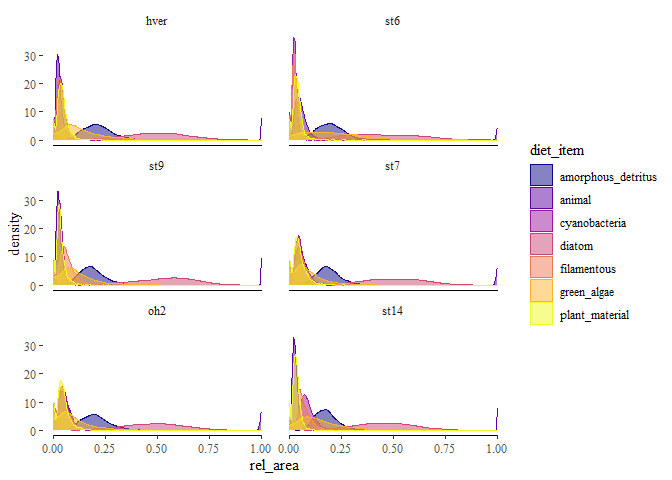
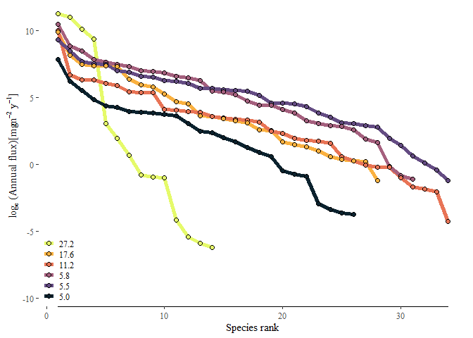
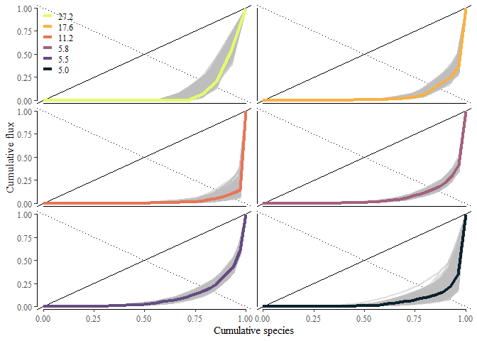
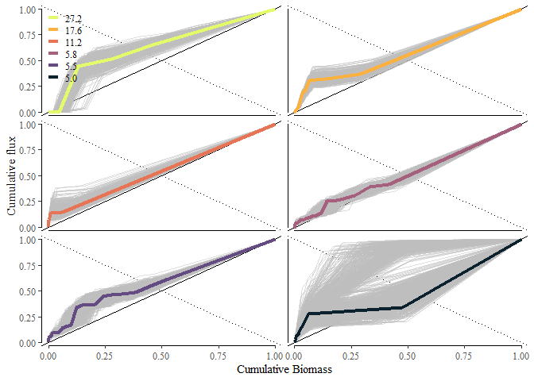
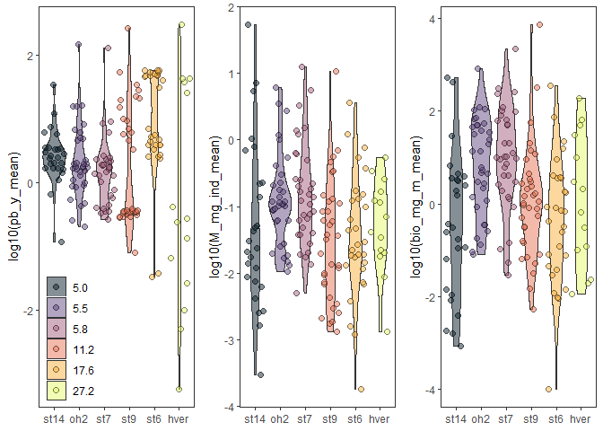
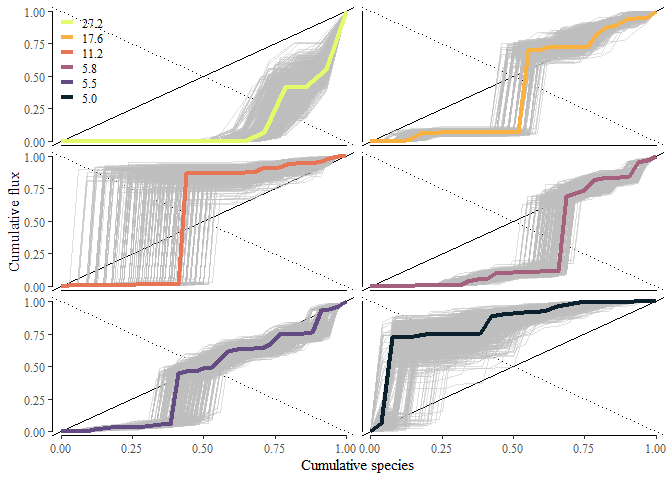
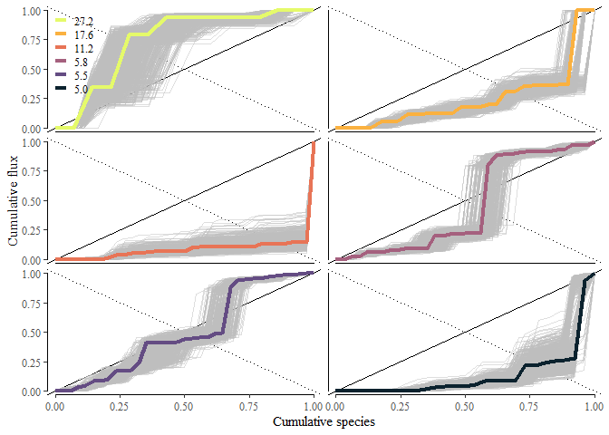

## Analysis

Preliminary figures for exploring data analyses and figures.

First, thing I did was find a way to model and propagate error of diets across sites. To do so, I build a bayesian random effects model that incorporated varying seasons, taxon, and streams and modeled the multinomial diet response using a dirichlet family distributional model. The model priors assume equal contribution of all diet items, which is conservative, but it outputs posterior distributions of diet proportions. These we can draw from for each taxa and each bootstrap to incorporate uncertainty through the flux estimates. I only estimated this for non-predators and then predators assumed to have a diet of 100% animal material. The posterior distributions look something like the plot below. This is subsampled to allow for a more manageable plot file size, but it captures the distributions.

### Stream-level posterior distributions of diet contributions

<!-- -->

### Rank plots

When we look at the distribution of OM flux to taxa, we see varying evenness in the distributions of OM fluxes. One way to view this is rank-production plots:

<!-- -->

This gives the impression that the evenness of production is highest in the mid range temperatures. However, evenness is not as straightforward because evenness is related to species richness in almost all formulations of it. A consensus seems to be emerging that evenness must be corrected for richness to compare across sites [@chao2019]. Once we correct for this we see evenness is not lowest at higher temperatures, but in the middle when we account for species richness. This is based on the Gini index which measures inequality and when standardized ranges from 0 to 1.


|site | tempC| Non-normalized Gini_mean| Non-normalized Gini_quant2.5| Non-normalized Gini_quant97.5| Normalized Gini_mean| Normalized Gini_quant2.5| Normalized Gini_quant97.5|
|:----|-----:|------------------------:|----------------------------:|-----------------------------:|--------------------:|------------------------:|-------------------------:|
|hver | 27.19|                     0.22|                         0.18|                          0.27|                 0.15|                     0.11|                      0.19|
|st6  | 17.62|                     0.13|                         0.11|                          0.16|                 0.10|                     0.08|                      0.13|
|st9  | 11.21|                     0.07|                         0.05|                          0.10|                 0.04|                     0.02|                      0.07|
|st7  |  5.82|                     0.15|                         0.14|                          0.17|                 0.12|                     0.11|                      0.14|
|oh2  |  5.49|                     0.22|                         0.19|                          0.24|                 0.19|                     0.17|                      0.22|
|st14 |  4.97|                     0.14|                         0.10|                          0.21|                 0.10|                     0.06|                      0.17|

Another way to view this is to look at the accumulation of flux across the accumulation of species standardize 0-1. This is often viewed as a Lorenz curve. Here we order species by annual flux, $x_i$ is the annual flux of species *i*, such that $x_1 < x_2 < ... < x_n$. If every species contributes an equal amount to production the Lorenz curve falls along the solid 1:1 line on the plot. The bold colored lines represent the mean value and each grey line is an individual bootstrapped estimate. 

### Lorenz curves of cumulative flux with species

<!-- -->

Here we see that total community flux accumulates differently across the streams. There are a few instances when it looks like abrupt 'jumps' in cumulative flux. These are mostly driven by species that dominate biomass. When we look at how flux accumulates with biomass we see the curves fall near the 1:1 lines, which is expected since standing biomass strongly influences production. In st14 we see lots of variation driven by empty samples and low sample size in the winter.  

### Lorenz curve of cumulative flux v. biomass

<!-- -->

This allows us an opportunity to look how total community flux accumulates across different species traits in a standardized way. So rather than the distribution differences attributed to different absolute magnitudes they are attributed to the relative magnitudes. So how does temperature modify how flux accumulates with species traits such as annual P:B and mean body size. First, a look at the distribution of traits across taxa in the streams.

### Histograms of PB, M, and Biomass among streams.

<!-- -->

So how does flux accumulate with annual *P:B* across sites? Here, we order each species by *P:B*, such that $pb_1 < pb_2 < ... < pb_n$. We see the most striking differences at the warmest and coldest sites. At hver, OM flux is disproportionately skewed towards taxa with higher annual *P:B* and in st14 flux is disproportionately skewed towards low *P:B* taxa.

### Accumulation of flux with P:B across sites

<!-- -->

So how does flux accumulate with mean body size, *M*, across sites? Here, we order each species by *M*, such that $M_1 < M_2 < ... < M_n$. This give a complementary story to *P:B*, flux in hver is disproportionately skewed towards lower *M*, and st14 skewed towards larger relative *M*. We are also able to glean a bit more information from some of the mid temperature streams. In st9 (11.2 $^\circ$C) the largest taxa also has the largest flux (and biomass)

### Accumulation of flux with M across sites

<!-- -->


## Reproducibility

<details>

<summary>

Reproducibility receipt

</summary>


```
## [1] "2021-02-10 15:10:06 CST"
```

```
## Local:    main C:/Users/james/Documents/Projects/temperature_energy-flux
## Remote:   main @ origin (https://github.com/jimjunker1/temperature_energy-flux.git)
## Head:     [462d168] 2021-02-08: added lorenz analysis and figures. Next do asymmetry analysis.
```

```
## R version 4.0.3 (2020-10-10)
## Platform: x86_64-w64-mingw32/x64 (64-bit)
## Running under: Windows 10 x64 (build 19041)
## 
## Matrix products: default
## 
## locale:
## [1] LC_COLLATE=English_United States.1252 
## [2] LC_CTYPE=English_United States.1252   
## [3] LC_MONETARY=English_United States.1252
## [4] LC_NUMERIC=C                          
## [5] LC_TIME=English_United States.1252    
## 
## attached base packages:
##  [1] parallel  stats4    grid      stats     graphics  grDevices utils    
##  [8] datasets  methods   base     
## 
## other attached packages:
##  [1] knitr_1.30               junkR_0.2.0              tidybayes_2.3.1         
##  [4] brms_2.14.4              Rcpp_1.0.6               rstan_2.21.2            
##  [7] StanHeaders_2.21.0-7     rriskDistributions_2.1.2 cowplot_1.1.1           
## [10] magick_2.5.2             ggraph_2.0.4             igraph_1.2.6            
## [13] ggeffects_1.0.1          ggthemes_4.2.0           bbmle_1.0.23.1          
## [16] broom_0.7.3              viridis_0.5.1            viridisLite_0.3.0       
## [19] fluxweb_0.2.0            ggridges_0.5.2           gridExtra_2.3           
## [22] TTR_0.24.2               httr_1.4.2               lubridate_1.7.9.2       
## [25] chron_2.3-56             tictoc_1.0               rmarkdown_2.6           
## [28] dflow_0.0.0.9000         fnmate_0.0.1.9000        furrr_0.2.1             
## [31] future_1.21.0            forcats_0.5.0            stringr_1.4.0           
## [34] dplyr_1.0.3              purrr_0.3.4              readr_1.4.0             
## [37] tidyr_1.1.2              tibble_3.0.6             ggplot2_3.3.3           
## [40] tidyverse_1.3.0          plyr_1.8.6               RCurl_1.98-1.2          
## [43] gtools_3.8.2             data.table_1.13.6        drake_7.13.0            
## [46] dotenv_1.0.2             conflicted_1.0.4         pacman_0.5.1            
## 
## loaded via a namespace (and not attached):
##   [1] tidyselect_1.1.0     lme4_1.1-26          htmlwidgets_1.5.3   
##   [4] devtools_2.3.2       munsell_0.5.0        base64url_1.4       
##   [7] codetools_0.2-18     DT_0.16              statmod_1.4.35      
##  [10] miniUI_0.1.1.1       withr_2.4.1          Brobdingnag_1.2-6   
##  [13] colorspace_2.0-0     filelock_1.0.2       highr_0.8           
##  [16] rstudioapi_0.13      bayesplot_1.7.2      listenv_0.8.0       
##  [19] labeling_0.4.2       emmeans_1.5.3        git2r_0.27.1        
##  [22] polyclip_1.10-0      farver_2.0.3         bridgesampling_1.0-0
##  [25] txtq_0.2.3           rprojroot_2.0.2      TH.data_1.0-10      
##  [28] coda_0.19-4          parallelly_1.22.0    vctrs_0.3.6         
##  [31] generics_0.1.0       xfun_0.20            markdown_1.1        
##  [34] R6_2.5.0             graphlayouts_0.7.1   gamm4_0.2-6         
##  [37] projpred_2.0.2       bitops_1.0-6         assertthat_0.2.1    
##  [40] promises_1.1.1       scales_1.1.1         multcomp_1.4-15     
##  [43] gtable_0.3.0         globals_0.14.0       processx_3.4.5      
##  [46] sandwich_3.0-0       tidygraph_1.2.0      rlang_0.4.10        
##  [49] splines_4.0.3        eha_2.8.4            inline_0.3.17       
##  [52] reshape2_1.4.4       yaml_2.2.1           abind_1.4-5         
##  [55] modelr_0.1.8         threejs_0.3.3        crosstalk_1.1.1     
##  [58] backports_1.2.1      rsconnect_0.8.16     httpuv_1.5.4        
##  [61] usethis_2.0.0        tools_4.0.3          ellipsis_0.3.1      
##  [64] sessioninfo_1.1.1    base64enc_0.1-3      progress_1.2.2      
##  [67] ps_1.5.0             prettyunits_1.1.1    zoo_1.8-8           
##  [70] haven_2.3.1          ggrepel_0.9.0        fs_1.5.0            
##  [73] magrittr_2.0.1       ggdist_2.4.0         colourpicker_1.1.0  
##  [76] reprex_0.3.0         mvtnorm_1.1-1        storr_1.2.5         
##  [79] matrixStats_0.57.0   pkgload_1.1.0        arrayhelpers_1.1-0  
##  [82] shinyjs_2.0.0        hms_0.5.3            mime_0.9            
##  [85] evaluate_0.14        xtable_1.8-4         shinystan_2.5.0     
##  [88] readxl_1.3.1         rstantools_2.1.1     testthat_3.0.1      
##  [91] compiler_4.0.3       bdsmatrix_1.3-4      V8_3.4.0            
##  [94] crayon_1.3.4         minqa_1.2.4          htmltools_0.5.1.1   
##  [97] mgcv_1.8-33          mc2d_0.1-18          later_1.1.0.1       
## [100] expm_0.999-5         RcppParallel_5.0.2   DBI_1.1.1           
## [103] tweenr_1.0.1         sjlabelled_1.1.7     dbplyr_2.0.0        
## [106] MASS_7.3-53          boot_1.3-25          Matrix_1.3-0        
## [109] cli_2.2.0            insight_0.11.1       pkgconfig_2.0.3     
## [112] RefManageR_1.3.0     numDeriv_2016.8-1.1  svUnit_1.0.3        
## [115] xml2_1.3.2           dygraphs_1.1.1.6     estimability_1.3    
## [118] rvest_0.3.6          distributional_0.2.1 callr_3.5.1         
## [121] digest_0.6.27        msm_1.6.8            cellranger_1.1.0    
## [124] curl_4.3             shiny_1.5.0          nloptr_1.2.2.2      
## [127] lifecycle_0.2.0      nlme_3.1-151         jsonlite_1.7.2      
## [130] desc_1.2.0           fansi_0.4.2          pillar_1.4.7        
## [133] lattice_0.20-41      loo_2.4.1            fastmap_1.0.1       
## [136] pkgbuild_1.2.0       survival_3.2-7       remotes_2.2.0       
## [139] glue_1.4.2           xts_0.12.1           shinythemes_1.1.2   
## [142] ggforce_0.3.2        stringi_1.5.3        memoise_1.1.0
```

</details>

## References
